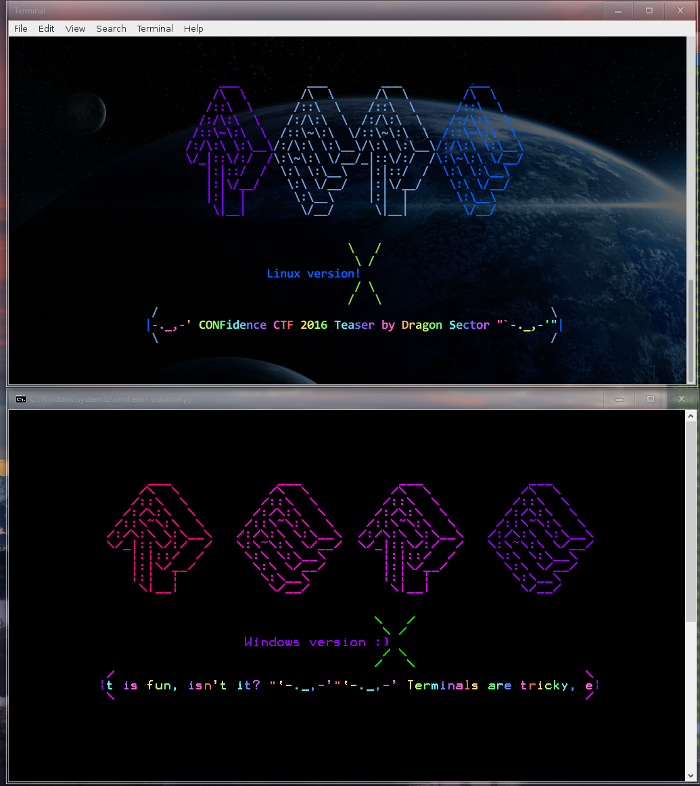

## FAQ

* **Q: The task crashes on my Python 2.6/3.X!**  
A: Please use Python 2.7.
* **Q: The task crashes on Python 2.7 as well!**  
A: The task was tested on 2.7.3 - 2.7.11 and worked - if it's a different
version, use one of these. If it's one of these, it's weird. It should work.
Ping gynvael WTF.
* **Q: The flag DrgnS{PythonRESoHard!} doesn't work!**  
A: The *real* flag will work :)
* **Q: The task looks horrible on my ConEmu/Console2/other Windows' non-standard
console emulator.**  
A: Please use vanila console.
* **Q: dis.dis crashes on this bytecode!**  
A: Yeees, it does, doesn't it? ;)

## REQUIREMENTS

None on server during CTF.

Python 2.7 for building the final file.

CTF player must have Python 2.7 installed, a decent terminal emulator and a normal OS (Windows Vista+/Linux/OSX).

## NOTES

If it doesn't work on your Python 2.7 setup, please let me know - we've tested on everything from Python 2.7.3 to 2.7.11, as well as Windows 10/Ubuntu/OSX and it seems to work, but I've might have missed something.

Also, this doesn't work on Windows XP and prior, and looks bad on ConEmu.

It should look like this:

